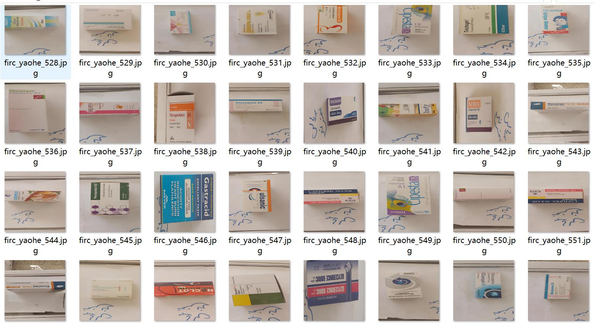
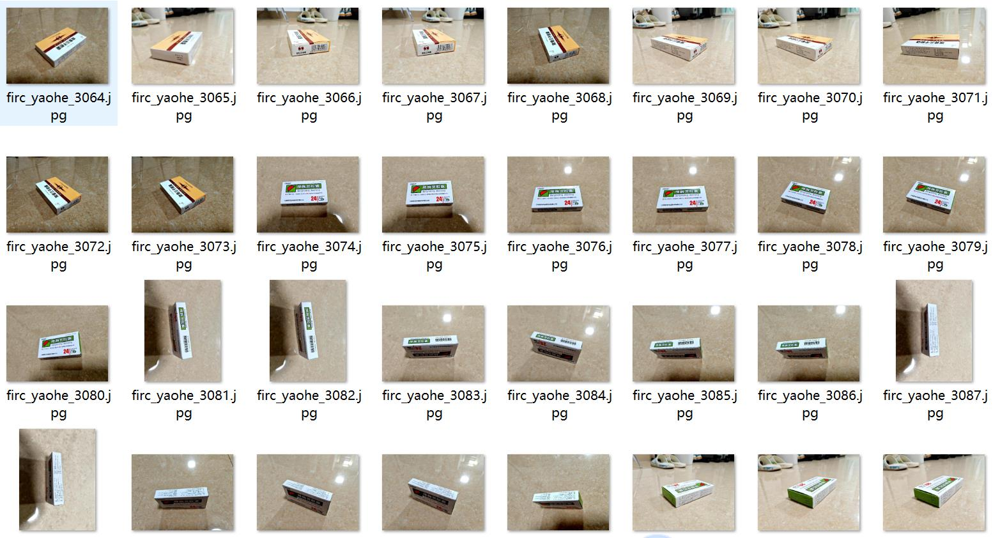
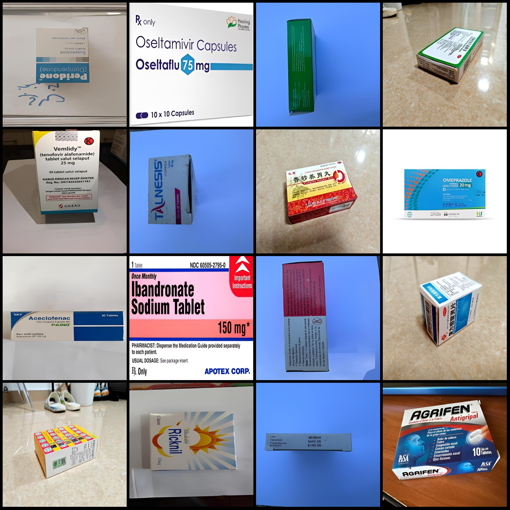
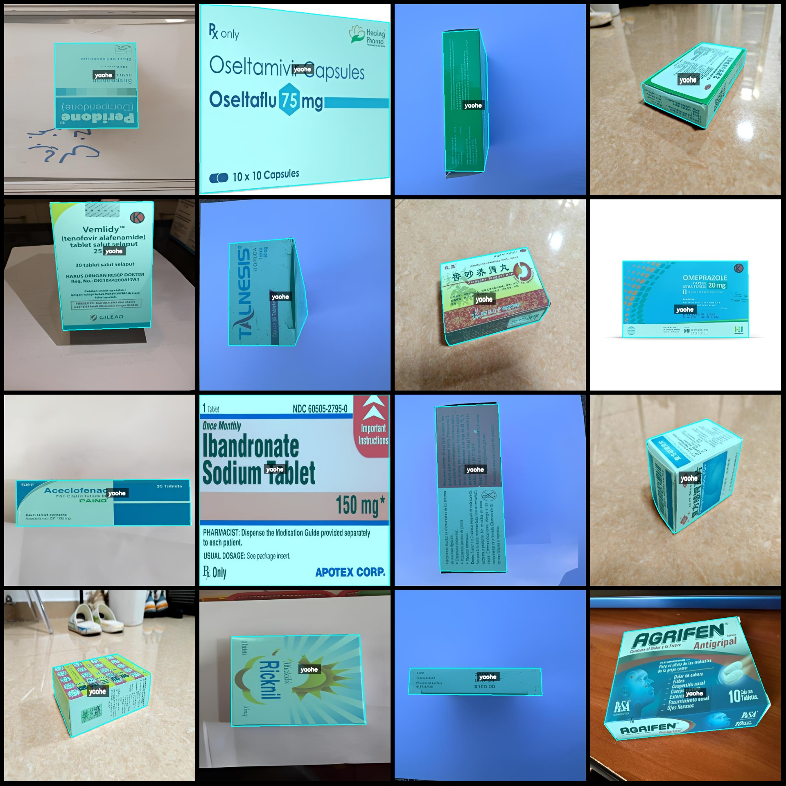
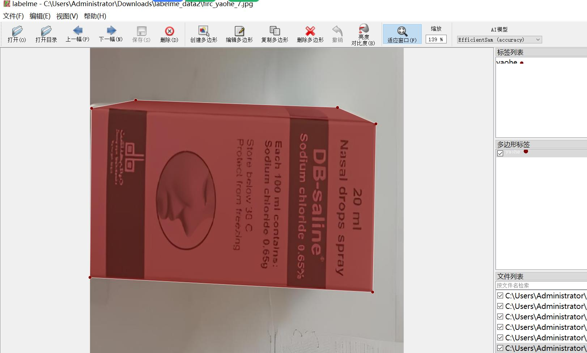
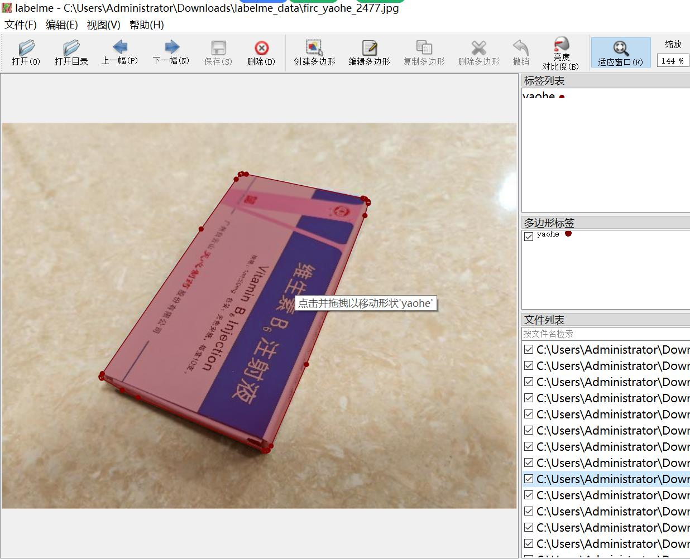

# Smart Health Medicine Drug Box Pharmaceutical Packaging Box Identification and Segmentation Dataset in LabelMe Format with 3449 Images in One Category

The dataset format: LabelMe (excluding mask files, only containing JPG images and corresponding JSON files)
Number of JPG images: 3449
Number of JSON files: 3449
Number of label classes: 1
Label class name: ["yaohe"]
Number of bounding boxes per category: 3498
Total number of bounding boxes: 3498
Labelme version used for segmentation: 5.5.0
Image resolutions: 624x624 (approximately 2450 images) and 640x480 (approximately 1000 images)
Annotation rules: Polygons are drawn around the categories
Important note: The dataset can be opened and edited using LabelMe, but the JSON dataset requires conversion to either Mask or Yolo format or Coco format for semantic segmentation or instance 
segmentation.
Special declaration: This dataset does not guarantee the accuracy of the trained model or weight files.
Image previews:
Annotation example:

Original images (randomly selected 16):

Annotation drawing results:

Labelme editing image examples:

## Image

Here is a pay link on Stripe ( https://buy.stripe.com/3cs8yP7sY87d0vu9AB ). Please contact me lonlonago@foxmail.com after funding $89, and I will send you a complete data files , thank you!

